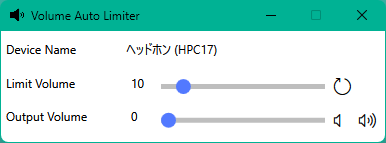

# VolumeAutoLimiter
日本語はここ -> [README.md](README.md)

An automatic volume limiter application for Windows. 
The output volume may vary depending on the connected device, such as headphones. 
This application adjusts the volume to a predetermined value even in such cases. 
It also automatically sets the output volume to 0 when the device is switched, preventing accidents such as sound leakage from speakers due to headphone disconnection.

When this application is launched, it forcibly sets the output volume to 0. 
Since this application monitors the output volume at a 1-second interval, the control may be delayed depending on the computer's load. 
When minimized, it will be displayed in the notification area. 

## Usage
1. Launch 
    Double-click the VolumeAutoLimiter.exe file in the built files. 
1. About the screen 
    
    1. Device Name 
        Displays the currently connected output device. 
        If there is no output device, "No Device" will be displayed. 
    2. Volume Limit 
        Automatically sets the volume to this value when it exceeds the volume limit. 
        The volume limit can be adjusted with a slider. 
        The changes will not be applied until the Update button is pressed. 
        The default value is 0.
    3. Output Volume 
        Displays the current output volume. 
        The output volume can be adjusted with a slider. 
        The Minimum Volume button sets the output volume to 0. 
        The Limit Volume button sets the output volume to the volume limit. 

    If there is no output device, 0 will be displayed. 

## LICENSE
[LICENSE](LICENSE) 

This application uses the following libraries. 
- [CommunityToolkit.Mvvm](VolumeAutoLimiter/Licenses/CommunityToolkit.txt) 
- [NAudio](VolumeAutoLimiter/Licenses/NAudio.txt) 

The icon is used from the following source. 
- [App Icon](https://icon-icons.com/ja/%E3%82%A2%E3%82%A4%E3%82%B3%E3%83%B3/%E3%82%B9%E3%83%94%E3%83%BC%E3%82%AB%E3%83%BC-%E3%82%AA%E3%83%BC%E3%83%87%E3%82%A3%E3%82%AA-%E9%9F%B3-%E5%A3%B0/148818)

## System Requirements
Windows 10/11 (x86/x64) 