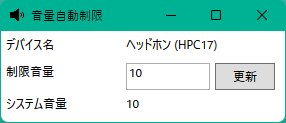

# VolumeAutoLimiter
Windows用の音量自動制限アプリ。 
接続したイヤホンなどデバイスによりシステム音量が変わる場合があります。 
このアプリは，そのような場合でもあらかじめ決めた数値になるように調整します。

## 使い方
1. 起動 
    ビルド済みファイル内の VolumeAutoLimiter.exe をダブルクリックします。
1. 画面について 
    
    1. デバイス名 
        現在接続中の出力デバイスが表示されます。 
        出力デバイスがない場合は，None が表示されます。
    1. 制限音量 
        制限音量を超える音量に変更されると，自動でこの音量に設定します。 
        0～100 の整数で設定します。 
        設定後は 更新ボタンを押下してください。 
        規定値は0です。
    1. システム音量 
        現在のシステム音量が表示されます。 
    出力デバイスがない場合は，0 が表示されます。

## LICENSE
[LICENSE](LICENSE) 

また，本アプリは以下のライブラリを使用しています。
- [CommunityToolkit.Mvvm](VolumeAutoLimiter/Licenses/CommunityToolkit.txt)
- [NAudio](VolumeAutoLimiter/Licenses/NAudio.txt)